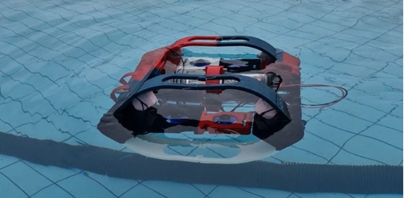
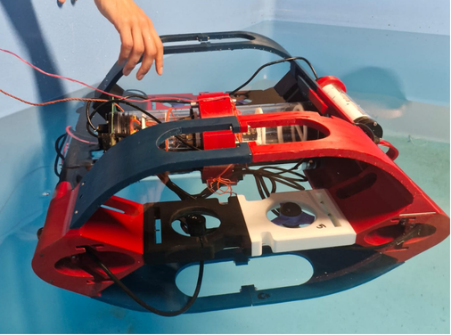
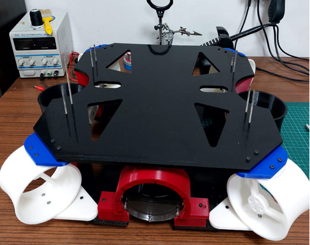

# TEKNOFEST — İnsansız Sualtı Sistemleri: PCB Tasarımları

TEKNOFEST İnsansız Sualtı Sistemleri Takımı'nda 1. ve 2. sınıfım boyunca yer aldım ve 
**Elektronik Ekip Sorumlusu** olarak görev aldım. Bu süreçte sualtı sistemlerinin 
elektronik tasarımı, üretimi ve entegrasyonu konusunda uçtan uca tecrübe kazandım. 
Altium Designer kullanarak tasarımını ve üretimini gerçekleştirdiğim PCB'ler bu depoda 
yer almaktadır. Her kart, sualtı aracının güvenli ve kararlı çalışmasına yönelik farklı 
bir işlevi üstlenmektedir.

## Projeler

### 🔹 [Sızıntı Sensörü](./sizinti-sensoru)
Elektronik haznelerde oluşabilecek su sızıntılarını bakır uçlar (prob) aracılığıyla 
algılayan ve transistör tabanlı anahtarlama ile uyarı sinyali üreten sensör kartı.

### 🔹 [Güç Dağıtım Kartı](./guc-dagitim-karti)
Farklı elektronik bileşenler arasında gücü merkezi olarak dengeleyen, 100A'lik entegre 
sigorta ile aşırı akım/kısa devreye karşı koruma sağlayan dağıtım kartı.

### 🔹 [Manyetik Anahtar](./manyetik-anahtar)
Hall sensörü ile manyetik alan değişimini algılayarak aracın güç sistemini temassız ve 
güvenli şekilde açıp kapatan anahtarlama kartı.

## Kullanılan Araçlar
Altium Designer 

## Notlar
Her klasörün içinde ilgili karta ait Altium proje dosyaları (.PrjPcb, .SchDoc, .PcbDoc), 
şematik/layout görselleri ve kartın çalışma mantığını anlatan kendi README dosyası bulunur.
