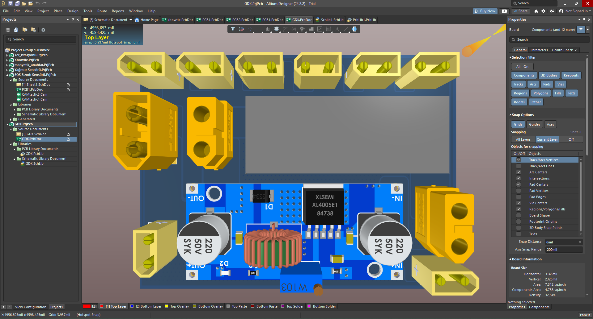
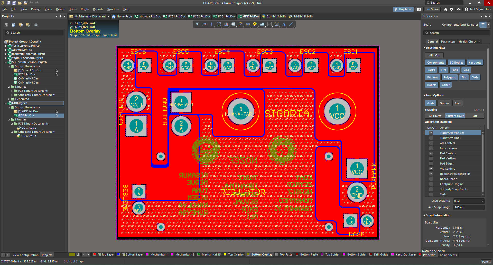
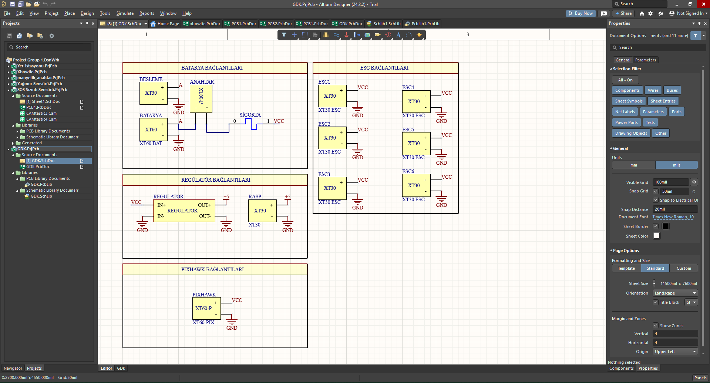

# Güç Dağıtım Kartı

İnsansız sualtı aracındaki farklı elektronik bileşenler arasında gücü dengeleyip merkezi 
bir şekilde yöneten, kablo karmaşasını önleyen ve birden fazla devre elemanını aynı anda 
besleyen bir güç dağıtım kartıdır.

Kart üzerinde bulunan 100A'lik entegre sigorta, aşırı akım veya kısa devre durumunda 
devreyi koruyarak sistem güvenliğini artırır.

## Şematik

## Devre Blokları

**Besleme ve Anahtarlama**
- Ana batarya (XT60) ve yardımcı batarya (XT30) girişleri
- Sigortalı ana anahtar (XT60-P) ile güç hattının güvenli açılıp kapanması

**Regülatör Bağlantıları**
- Giriş gerilimini +5V hattına dönüştüren regülatör devresi
- Raspberry Pi (RASP) için ayrı +5V beslemesi

**ESC Bağlantıları**
- 6 adet ESC (Electronic Speed Controller) için XT30 konnektörlü, ayrı VCC/GND hatlarına 
  sahip bağımsız besleme çıkışları — aracın motorlarını süren sürücülere güç dağıtımı

**Pixhawk Bağlantısı**
- Uçuş/kontrol kartı (Pixhawk) için ayrı XT60-P güç girişi

## Kullanılan Araçlar
Altium Designer (şematik ve PCB tasarımı)
