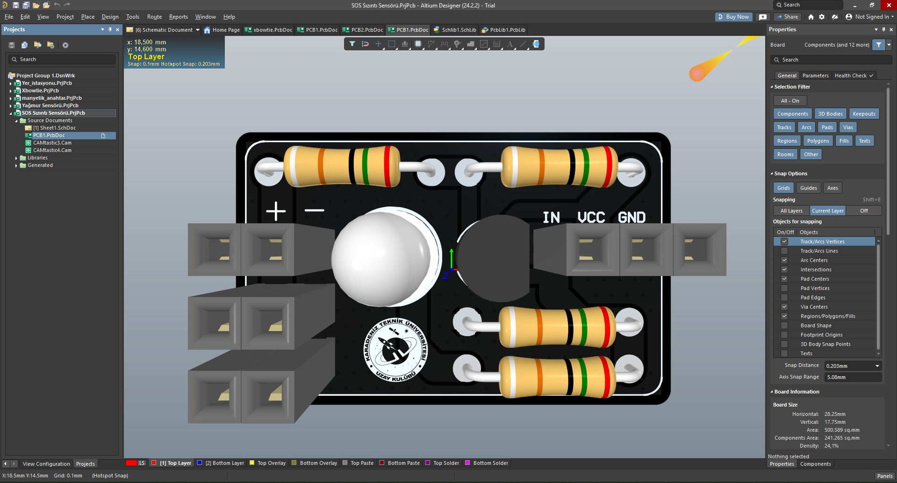
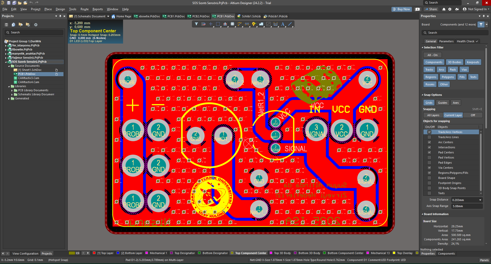
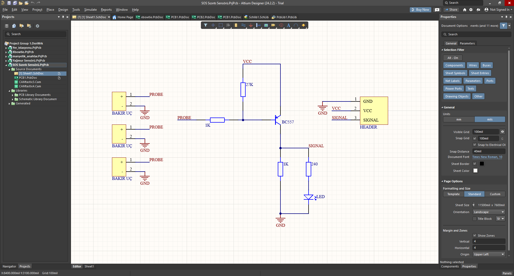

# Sızıntı Sensörü

İnsansız sualtı aracının elektronik haznelerinde oluşabilecek su sızıntılarını erken 
tespit etmek amacıyla tasarladığım bir sensör kartıdır.

Kart, hazne içine yerleştirilen bakır uçlar (prob) arasında su nedeniyle oluşan 
iletkenliği algılayarak devreyi tetikler ve uyarı sinyali üretir. Bu sayede su sızıntısı 
anında fark edilir, elektronik ekipmanların zarar görmesi önlenir ve aracın güvenliği 
sağlanır.

## Çalışma Mantığı
1. Haznenin içine yerleştirilen üç adet **bakır uç (PROBE)**, su ile temas ettiğinde 
   aralarında küçük bir akım geçişine izin verir
2. Bu sinyal, **BC557 transistörünün** anahtarlama özelliğini tetikler
3. Transistör iletime geçtiğinde SIGNAL hattı aktif olur, devredeki **LED** yanarak 
   görsel uyarı verir ve HEADER üzerinden SIGNAL çıkışı ana sisteme aktarılır

## Şematik

## Devre Blokları
| Bileşen | Görevi |
|---|---|
| Bakır Uçlar (3×) | Hazne içindeki suyu/sızıntıyı algılayan problar |
| R (1K) – Probe hattı | Akım sınırlama |
| R (27K) – VCC hattı | Transistör baz besleme direnci |
| BC557 (PNP Transistör) | Probe sinyaliyle tetiklenip anahtarlama yapar |
| LED + 240Ω direnç | Sızıntı anında görsel uyarı |
| HEADER (GND, VCC, SIGNAL) | Kartın ana sisteme bağlantı noktası |

## Kullanılan Araçlar
Altium Designer 
